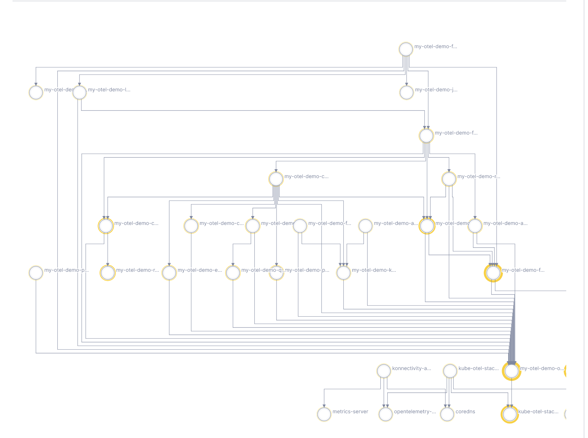

# without a trace

Generating Kubernetes service maps, no trace required.



**📓 [Lightstep Notebook Example](https://app.lightstep.com/dev-clay/notebooks/ls-internal-without-a-trace/dWfC3Fr6)**

### requirements

* k8s cluster connected to kubectl
* running services in the cluster (active network traffic needed)

### components

* `collector` - OpenTelemetry collector with a custom metrics receiver to inspect pod-level network traffic.
* `synthetic_traceassembler` - Python script that generates synthetic traces by querying the public Lightstep API for metrics sent by the collector (`query_timeseries` endpoint).

### deploy collector to cluster

Deploy a collector to a Kubernetes cluster to get metrics to build traces.

See `collector/readme.md` for instructions.

### run traceassembler locally

After the cluster is running, assemble synthetic traces from the metrics being sent into the account.

1. Install python dependencies: `pip3 install -r requirements.txt`

2. Make some synthetics traces from metrics:

```
    # these are different values!
    $ export LS_PROJ=your-ls-project-name
    $ export LS_ORG=your-ls-org-name
    $ export LS_API_TOKEN=your-api-token
    $ export LS_ACCESS_TOKEN=your_access_token
    $ python3 traceassembler.txt
```

3. Enjoy dependency maps without any trace instrumentation 🎉


